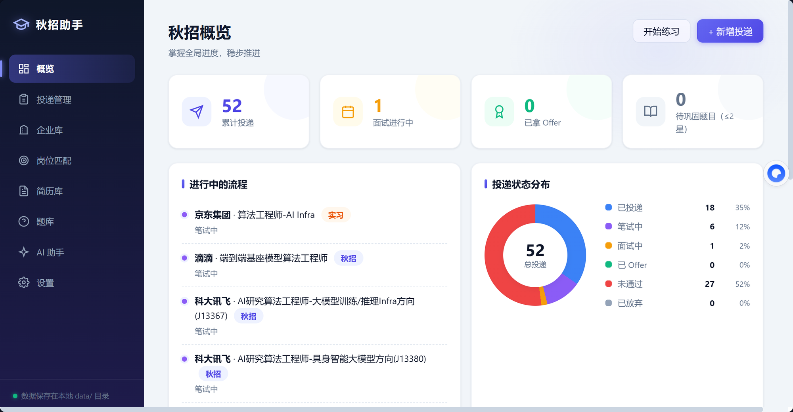

# 秋招助手

一站式秋招管理工具：**投递进度管理 + 简历库 + 笔面试题库 + AI 助手 + 浏览器插件自动填网申表单**。

数据全部保存在本地 JSON 文件，无需数据库；AI 能力走 OpenAI 兼容接口（Kimi / DeepSeek / 通义等均可接入）。

## ✨ 亮点

- [📊 投递进度管理](#-投递进度管理)：状态流水线 + 事件时间线 + AI 批量导入 + 邮箱自动同步
- [📄 简历库](#-简历库)：网申补充信息 + 结构化实习/项目经历 + AI 一键提取
- 📚 笔面试题库：掌握度评级 + 错题本 + 薄弱项优先练习（🚧 待开发）
- [🤖 AI 助手](#-ai-助手)：模拟面试出题 + 面试题详解 + 简历润色
- [🧩 浏览器插件自动填简历](#-浏览器插件自动填简历)：网申表单一键填写，适配北森 / Moka 等 ATS
- [🌐 内网穿透](#-内网穿透公网访问可选)：cloudflared 隧道暴露公网，手机 / 其他设备随时访问



## 🔥 News

- `2026/08/23` 🚀🚀 浏览器插件升级至 1.1.7：日历/月份选择器自动点选、多段经历按简历条数自动展开「添加经历」、实习/工作区块智能路由
- `2026/08/22` 🎉🎉 秋招助手开源发布！投递管理、简历库、题库、AI 助手、浏览器插件全量功能上线
- `2026/08/22` 🌐🌐 支持内网穿透：cloudflared 快速隧道把本地服务暴露到公网，手机随时查看投递进度
- `2026/08/22` ✨✨ 简历库支持结构化实习/工作/项目经历编辑与 AI 一键提取，网申补充信息覆盖 24 项常见字段
- `2026/08/22` 🚀🚀 插件支持自动上传简历附件与证件照，适配北森 / Moka 等 ATS 的自定义下拉组件
- `2026/08/21` 🌟🌟 邮箱进度同步上线：IMAP 定时拉取招聘邮件，AI 解析后自动更新投递状态

## 功能特性

### 投递管理
- 投递状态全流程跟踪：已投递 / 笔试中 / 面试中 / 已 Offer / 未通过 / 已放弃
- 每条投递支持事件时间线（笔试、各轮面试、Offer 等进展记录）
- 按状态筛选、按公司/岗位搜索
- **AI 批量导入**：粘贴招聘网站的大段文本或链接内容，AI 自动解析出公司、岗位、状态并入库

### 简历库
- 多简历管理（标签、求职目标、备注），支持上传简历附件（PDF/Word）与证件照
- **网申补充信息**：性别、民族、籍贯、身份证号、成绩排名、四六级、实验室、导师、微信/QQ 等 24 项网申常见字段
- **结构化经历编辑**：实习/工作经历（公司、职位、部门、工作性质、起止时间、职责、描述）与项目经历分段管理
- **AI 一键提取**：从简历正文自动提取补充信息、实习经历、项目经历，核对后保存

### 题库（🚧 待开发）
- 规划中：笔面试题 / 八股 / 场景题分类管理，掌握度评级、错题本、练习模式

### AI 助手
- 自由问答、模拟面试出题、面试题详解、回答评估、简历润色

### 邮箱进度同步（可选）
- IMAP 定时拉取招聘通知邮件（每 6 小时），AI 解析后自动更新投递状态、收录新投递

### 内网穿透（可选）
- 支持用 cloudflared 快速隧道把本地服务暴露到公网，手机或其他设备随时查看投递进度、管理简历
- 浏览器插件会自动跳过助手页面本身，不会干扰正常使用

### 浏览器插件（核心亮点）
在企业校招官网一键自动填写网申表单，支持北森 / Moka 等常见 ATS：

- 自动扫描页面表单字段（文本框、下拉、单选、自定义组件），AI 按简历内容逐字段生成填写值
- **自定义组件适配**：div 模拟下拉、日历/月份选择器自动点选、「至今」勾选
- **自动上传简历附件**触发官网解析，**自动上传证件照**
- **多段经历自动展开**：按简历里的经历条数自动点「添加经历」按钮凑够组数
- **区块智能路由**：实习经历与工作经历区块自动区分，页面只有工作区块时实习按规则填入
- **同步投递进度**：抓取当前页面文本，AI 识别投递记录并同步回台账；可加入每日自动同步（每 12 小时后台执行）

## 技术栈

| 层 | 技术 |
| --- | --- |
| 后端 | Python 3 · FastAPI · Uvicorn · Pydantic |
| AI 调用 | httpx 异步请求 OpenAI 兼容 `/chat/completions` 接口 |
| 存储 | 纯标准库 JSON 文件存储（`threading.Lock` 保证并发安全），无需数据库 |
| 邮件 | imaplib（IMAP 拉取）+ AI 解析 |
| 前端 | 原生 HTML / CSS / JavaScript 单页应用（无框架、无构建步骤） |
| 浏览器插件 | Chrome Extension Manifest V3（Content Script + Service Worker） |

## 安装与运行

要求：Python 3.10+

```bash
# 1. 克隆仓库
git clone https://github.com/Starry-16/AI-Offer.git
cd AI-Offer

# 2. 安装依赖
pip install -r requirements.txt

# 3. 启动服务
python -m uvicorn app.main:app --port 8000
```

打开浏览器访问 <http://127.0.0.1:8000> 即可使用。

> 首次启动会自动在项目根目录创建 `data/` 文件夹，初始化投递、简历、题库、配置等 JSON 文件，并写入内置企业库。

## 亮点操作指南

### 0. 前置：配置 AI（必做）

打开「设置」页，填入任一 OpenAI 兼容服务的配置：

- 接口地址（如 `https://api.moonshot.cn/v1`）
- API Key
- 模型名

### 📊 投递进度管理

1. **手动新增**：投递管理 → 右上角「新增投递」→ 填公司、岗位、类别（秋招/实习）、当前状态
2. **AI 批量导入**：粘贴招聘网站或邮件里的大段文本，AI 自动解析出公司/岗位/状态，预览确认后入库
3. **进展跟踪**：点进一条投递记录，添加事件（笔试、一面、二面、Offer…）形成时间线；状态变更直接在卡片上切换
4. **邮箱自动同步（可选）**：设置页配置邮箱 IMAP（QQ/163 需在邮箱设置里开启 IMAP 并获取授权码），之后服务端每 6 小时自动解析招聘邮件、更新投递进度、收录新投递

### 📄 简历库

1. 简历库 →「新建简历」：粘贴简历正文，填写求职目标与标签
2. 上传**简历附件**（PDF/Word，插件用它触发官网自动解析）与**证件照**
3. 点「**AI 提取补充信息**」：自动填充 24 项网申常见字段（性别/民族/籍贯/身份证号/四六级/实验室/导师/微信/QQ 等）与结构化实习/项目经历
4. 人工核对提取结果后保存；可按不同岗位方向维护多份简历，插件填表时按需选择

### 📚 笔面试题库（🚧 待开发）

规划中，敬请期待。

### 🤖 AI 助手

1. AI 助手页直接输入问题，Ctrl+Enter 发送（简历、面试、秋招规划都可以问）
2. 快捷指令「**模拟面试出题**」：结合你的简历与求职目标生成面试题
3. 快捷指令「**面试题详解**」：先输入题目，AI 给出标准答案思路
4. 在简历库编辑简历时使用「**简历润色**」，优化经历表述

### 🧩 浏览器插件自动填简历

1. **准备数据（先填好基本信息）**：插件填表的内容全部来自本地简历库——先按上文「[📄 简历库](#-简历库)」新建简历，粘贴简历正文、上传简历附件与证件照，并用「AI 提取补充信息」填好网申字段和实习/项目经历，核对保存
2. **安装插件**：浏览器打开 `chrome://extensions`（Edge 为 `edge://extensions`）→ 开启「开发人员模式」→「加载解压缩的扩展」→ 选择本仓库的 `extension/` 目录；使用时保持本地服务运行
3. **填写**：打开企业校招官网的网申页面 → 点右下角「秋」悬浮按钮 → 选择要用的简历 → 点「**自动填写本页表单**」
   - 插件自动上传简历附件触发官网解析、自动上传证件照
   - 多段经历自动点「添加经历」凑够组数，实习/工作区块智能路由
   - 日历/下拉等自定义组件自动点选，填好的字段绿色高亮
4. **核对**：检查标绿内容无误后自行提交
5. **进度同步**：在投递记录页点「同步本页投递进度」，AI 识别页面记录并同步回台账；勾选「每天自动同步本页进度」后，浏览器开启时每 12 小时后台自动执行

### 🌐 内网穿透（公网访问，可选）

1. 到 [cloudflared 官方仓库](https://github.com/cloudflare/cloudflared/releases)下载对应平台的 `cloudflared`
2. 本地服务已启动的前提下，运行：
   ```bash
   cloudflared tunnel --url http://localhost:8000
   ```
3. 终端会输出一个 `https://xxx.trycloudflare.com` 公网地址，手机或其他设备直接访问即可（数据仍保存在你本机，隧道关闭后公网地址立即失效）

## 项目结构

```
├── app/
│   ├── main.py            # FastAPI 入口：路由注册、静态页面、定时任务
│   ├── storage.py         # JSON 文件存储层（线程安全）
│   ├── seed_data.py       # 内置企业库种子数据
│   ├── routers/           # applications / resumes / questions / companies / ai / email
│   ├── services/          # ai_service（OpenAI 兼容调用）、email_service（IMAP 同步）
│   └── static/            # 前端 SPA（原生 HTML/CSS/JS）
├── extension/             # 浏览器插件（MV3）
│   ├── manifest.json
│   ├── background.js      # Service Worker：代理本地 API、附件转 base64、每日自动同步
│   └── content.js         # 内容脚本：表单扫描、AI 填写、自定义组件适配、进度同步
├── data/                  # 本地数据（首次运行自动创建，已在 .gitignore 排除）
└── docs/                  # README 截图
```

## 数据与隐私

所有数据（简历、投递记录、AI Key、邮箱授权码、附件、证件照）均保存在本地 `data/` 目录，不会上传任何第三方服务器；AI 请求仅发送你主动触发的内容。`data/` 已被 `.gitignore` 排除，请勿手动提交。
